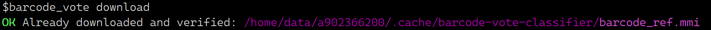

# barcode-vote-classifier

Classify barcode-related reads/contigs using minimap2 (PAF) + vote logic.

## Requirements
- Python >= 3.8
- minimap2 in PATH

## Install

### Install && update from GitHub
```bash
## install
pip install git+https://github.com/ypchan/barcode-vote-classifier.git

## update
pip uninstall barcode-vote-classifier
pip install git+https://github.com/ypchan/barcode-vote-classifier.git
```
### Usage
```
# download reference db
barcode_vote download
```
